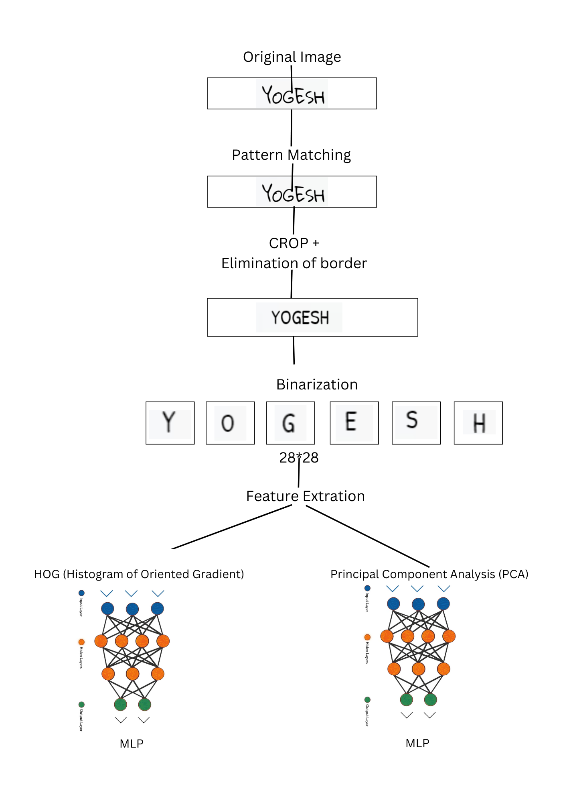

# OCR: Handwritten Text Rcognition

## Description

The Handwritten Text Recognition (HTR) project aims to develop a specialized system for recognizing handwritten text from images. Unlike printed text, handwritten text poses challenges due to variations in style, size, and shape, making accurate recognition difficult.

## Table of Contents

- [Installation](#installation)
- [Dataset](#dataset)
- [Feature Extraction](#feature-extraction)
- [Results](#results)

## Installation

You can download the code, run .ipynb file and provide dataset directory accordingly.

## Dataset

Either you can use dataset from our git hub or you can download dataset from [Kaggle](https://www.kaggle.com/datasets/crowdflower/handwritten-names/data).

## Feature Extraction

## Results

